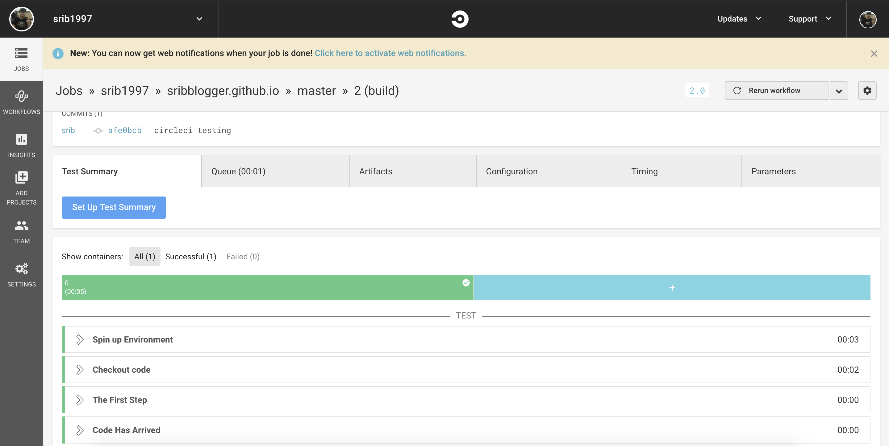
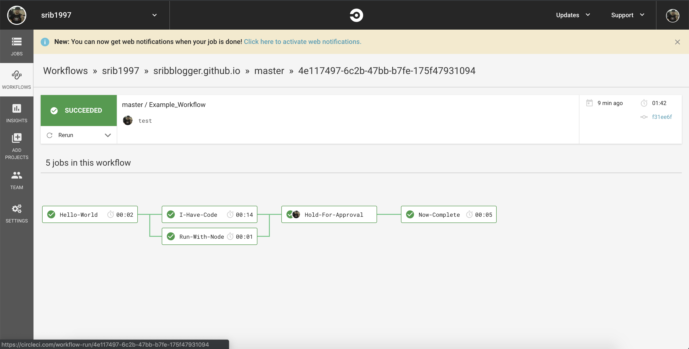

# CircleCI配置入門

本指南描述了 CircleCI 如何查找和運行 config.yml 以及如何使用 shell 命令執行操作，然後概述了 config.yml 如何與代碼交互並啟動構建，然後如何使用docker容器精確運行 你需要的環境。

最後，對工作流進行簡短的探索，以便您可以學習編排構建，測試，安全掃描，批准步驟和部署。

CircleCI 認為配置（configuration）是代碼。 因此，從構建到部署的整個交付過程通過名為 config.yml 的單個文件進行編排。 

config.yml 文件位於項目頂部名為 .circleci 的文件夾中。 CircleCI使用YAML語法進行配置。

---

## 第一部分：您好，這是關於 Shell 的全部

讓我們開始吧。 CircleCI 提供了強大的體驗，因為我們為您提供了一個 on-demand shell，可以運行您需要的任何內容。 

在第一個示例中，我們將向您展示設置第一個構建和執行shell命令是多麼容易。

1. 如果您還沒有 ready ，請使用 CircleCI 註冊並選擇 GitHub 或 Bitbucket，也可以通過 GitHub 註冊。

2. 確保已添加要管理的項目。

3. 在項目主分支的頂部添加 .circleci 文件夾。 如果你想在不同的分支上進行實驗，你也可以這樣做。 確保文件夾以句點開頭。 此文件夾是特殊的，因此是 .circleci 格式。

4. 在.circleci文件夾中添加config.yml文件。

5. 將以下內容添加到config.yml文件中。

```yml
version: 2.0
jobs:
 build:
   docker:
     - image: alpine:3.7
   steps:
     - run:
         name: The First Step
         command: |
           echo 'Hello World!'
           echo 'This is the delivery pipeline'
```

解釋:

CircleCI 配置語法非常簡單。最棘手的部分通常是**縮進**。確保縮進一致。這是配置中最常見的錯誤。讓我們詳細介紹九行

第1行：這表示您正在使用的 CircleCI 平台的版本。 2.0是最新版本。

第2-3行：job 級別包含任意命名的子集合。 build 是 job 集合中第一個命名的子項。在這種情況下，build 也是唯一的job。

第6-7行：step 集合是運行指令的有序列表。每個運行指令都按聲明(order)的順序執行。

第8行：name 屬性在返回警告，錯誤和輸出時提供有用的組織信息。作為構建過程中的操作，該名稱應該對您有意義

第9-11行：這是魔術。 command 屬性是一個 shell 命令列表，表示您要完成的工作。初始管道 | 表示將有多行 shell 命令。這裡第10行將打印出Hello World！在您的構建 shell 和第11行將打印出 This is the delivery pipeline

---

## 第二部分：Info 和準備 Build

這很好，但讓我們變得真實。 交付圖表以代碼開頭。 在這個例子中，我們將添加幾行來獲取代碼然後列出它。 和第一次的差不多。

1. 如果您還沒有 ready，請通過第一部分並在項目中添加一個簡單的 .circleci / config.yml 文件。

2. CircleCI 提供了許多簡化的命令，您可以使用這些命令輕鬆地進行複雜的交互。 這裡我們將添加 checkout 命令。 此命令自動獲取分支代碼，供您在後續步驟中使用。

3. 現在，添加第二個運行步驟並執行 ls -al 以查看所有代碼都可用。

```yml
version: 2.0
jobs:
 build:
   docker:
     - image: alpine:3.7
   steps:
     - checkout
     - run:
         name: The First Step
         command: |
           echo 'Hello World!'
           echo 'This is the delivery pipeline'
     - run:
         name: Code Has Arrived
         command: |
           ls -al
           echo '^^^That should look familiar^^^'
```



解釋:

雖然我們只對配置進行了兩處小的更改，但這些更改代表了重要的組織概念( significant organizational concepts)。

第7行：checkout命令是一個內置保留字的示例，它將您的工作設置為上下文。 在這種情況下，它會下拉( pulling down)您的代碼，以便您可以開始構建。

第13-17行：構建(build)作業的第二次運行是列出（通過ls -al）checkout 的內容。 您的分支現在可供您進行交互。

---

## 第三部分：That’s nice but I need…

每個代碼庫(code base)和項目(probject)都是不同的。 沒關係。 我們喜歡多樣性。 這是我們允許您在所選 機器 或 docker container 中運行的原因之一。 

在這種情況下，我們將演示在可用節點的容器中運行。 其他示例可能包括macOS機器，Java容器甚至GPU。

1. 本節對第一部分和第二部分進行了擴展。 如果您還沒有 ready ，請至少完成第一部分，以確保您的分支中有一個有效的 config.yml 文件。

2. 這是一個非常簡單但卻非常強大的變化。 我們將為構建作業 (build job)添加對 docker image的引用。

```yml
version: 2.0
jobs:
 build:
   # pre-built images: https://circleci.com/docs/2.0/circleci-images/
   docker:
     - image: circleci/node:10-browsers
   steps:
     - checkout
     - run:
         name: The First Step
         command: |
           echo 'Hello World!'
           echo 'This is the delivery pipeline'
     - run:
         name: Code Has Arrived
         command: |
           ls -al
           echo '^^^That should look familiar^^^'
     - run:
         name: Running in a Unique Container
         command: |
           node -v
```

解釋:

以上對配置的兩個更改會顯著影響您完成工作的方式。通過將 docker 容器與作業相關聯，然後在容器中動態運行作業，您無需執行特殊的魔術或操作來升級，試驗或調整您運行的環境。只需稍加更改即可大幅升級一個mongo環境，增長或縮小基本image，甚至更改語言。

第4行：我們在這裡看到 yml 中的註釋。與任何其他代碼單元一樣，註釋是一個有用的工具，因為配置變得複雜。

第5-6行：這些行表示用於 jobs 的 docker image。因為您的配置中可以有多個作業（我們將在下面看到），您還可以在不同的環境中運行配置的不同部分。例如，您可以在 thin Java容器中執行構建作業，然後使用預安裝了瀏覽器的容器執行測試作業。
在這種情況下，它使用CircleCI的預構建容器，該容器已經內置了瀏覽器和其他有用的工具。

第19-22行：這些行添加一個run step ，container 中返回 node 用的版本。嘗試使用CircleCI預先構建的便利圖像(pre-built convenience images)或Docker hub的公共容器中的不同容器進行試驗。

---

## 第四部分：Approved to Start

到現在為止還挺好？讓我們花一點時間討論編排。在此示例中，我們將花費更多時間進行分析而不是逐步修改。 CircleCI工作流程基於前任作業的編排（orchestration of predecessor jobs）。這就是需要用於工作流定義的保留字的原因。工作啟動總是根據先前工作的成功完成來定義。例如，諸如[A，B，C]的 job 用job B和job C實現，每個 job 都需要 job 先行。job A不會有需求塊，因為它立即啟動。例如，工作A立即開始; B要求A; C要求B.

在下面的示例中，觸發構建的事件將導致Hello-World立即啟動。其餘的工作將等待。當Hello-World完成時，I-Have-Code和Run-With-Node都將啟動。這是因為I-Have-Code和Run-With-Node要求Hello-World在啟動之前成功完成。接下來，當I-Have-Code和Run-With-Node都完成時，名為Hold-For-Approval的批准作業將變為可用。 Hold-For-Approval工作與其他工作略有不同。它表示允許工作流程繼續的手動干預。當工作流等待用戶（通過CircleCI UI或API）批准作業時，將根據原始觸發事件保留所有狀態。 CircleCI了解審批工作可能需要數小時甚至數天才能完成 - 儘管我們建議工作時間超過幾天。一旦通過手動干預完成Hold-For-Approval，將運行最終作業Now-Complete。

所有工作名稱都是任意的。這使您可以根據需要創建複雜的工作流，同時保持對下一個讀取config.yml的開發人員的有意義和清晰。

```yml
version: 2.0
jobs:
 Hello-World:
   docker:
     - image: alpine:3.7
   steps:
     - run:
         name: Hello World
         command: |
           echo 'Hello World!'
           echo 'This is the delivery pipeline'
 I-Have-Code:
   docker:
     - image: alpine:3.7
   steps:
     - checkout
     - run:
         name: Code Has Arrived
         command: |
           ls -al
           echo '^^^That should look familiar^^^'
 Run-With-Node:
   docker:
     - image: circleci/node:10-browsers
   steps:
     - run:
         name: Running In A Container With Node
         command: |
           node -v
 Now-Complete:
   docker:
     - image: alpine:3.7
   steps:
     - run:
         name: Approval Complete
         command: |
           echo 'Do work once the approval has completed'

workflows:
 version: 2
 Example_Workflow:
   jobs:
     - Hello-World
     - I-Have-Code:
         requires:
           - Hello-World
     - Run-With-Node:
         requires:
           - Hello-World
     - Hold-For-Approval:
         type: approval
         requires:
           - Run-With-Node
           - I-Have-Code
     - Now-Complete:
         requires:
           - Hold-For-Approval]
```

解釋:

我們現在知道如何創建包含手動門(manual gate)的工作流程(workflow)，您可以使用手動門來保護昂貴的交互。

第3行：echo的Hello World命令！已經完成了一項名為Hello-World的完整工作

第12行：獲取代碼的命令現在位於名為I-Have-Code的作業中

第22行：使用CircleCI預建圖像的Node示例現在稱為Run-With-Node

第30行：還有一個與Hello-World類似的其他作業，但在批准完成之前它不會運行 - 請參閱工作流程節中的第57行。

第39-57行：配置現在有一個工作流程。在前面的示例中，CircleCI引擎將配置解釋為具有單作業(single-job )工作流(workflow)。在這裡，我們保持清晰，並拼寫出我們想要執行的工作流程。此工作流演示了幾個有用的功能requires語句表示必須在有問題的作業開始之前成功完成的先前作業的列表。在此示例中，I-Have-Code和Run-With-Node必須在Hold-For-Approval變為活動狀態之前完成。此外，I-Have-Code和Run-With-Node都依賴於Hello-World，但不依賴於其他。這意味著只要Hello-World完成，這兩個作業就會並行運行。如果您有多個不直接相互依賴的作業並且希望改善掛鐘時間，則此功能非常有用。



第50-51行：大多數工作都是通用的。但是，這個工作有一個類型(type)。在這種情況下，類型是批准，並且需要人員通過CircleCI API或UI來完成構建build的操作。(去circleci website 的 probject 的 workflow 人手批淮)

---

現在開始自動化您的 CI / CD世界！

---
參考文章:
[Configuration Introduction](https://circleci.com/docs/2.0/config-intro/#section=configuration)