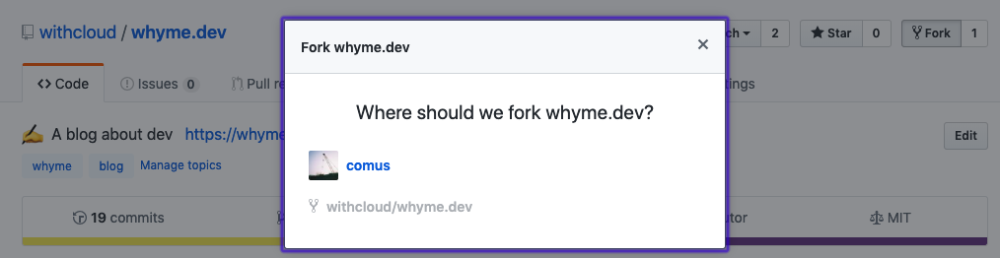

一個概念，**共享**，我們會將開發的過程做整理然後寫成 Blog 的文章。
一來可以自己做資料整理，二來是讓公司其他成員可以互相了解所做的事。

要在 Why Me 裡新增一篇文章，最簡單直接的做法是先 Fork [withcloud/whyme.dev](https://github.com/withcloud/whyme.dev)



然後可以在 Terminal 執行

```shell
git clone https://github.com/comus/whyme.dev.
cd whyme.dev
yarn
yarn dev
```

為程式碼建立新的 branch。例如 `new-post`。

在 `content/blog` 資料夾中，參照裡面其他資料夾建立新文章。
由於之前執行了 `yarn dev`，所以可以一邊編輯文章，一邊到 [localhost:8000](http://localhost:8080) 查看文章出來的效果。

完成編輯後，`git push` 上你 Forked 的 Github Repo，
然後建立 Pull Request 到 `withcloud/whyme.dev`，我會儘快 merge 你的 Pull Request。

當 merge 完成後，`withcloud/whyme.dev` 會透過 CircleCI 自動 Deploy 到 NOW。可以稍後到 https://whyme.dev 查看已發佈的文章。而每天的早上 08:00 會將前一天的所有新文章寄 email 通知各個成員。