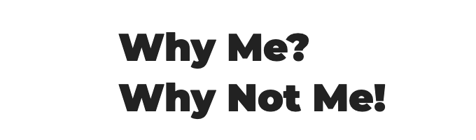
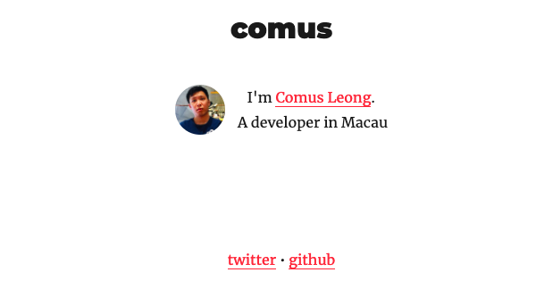
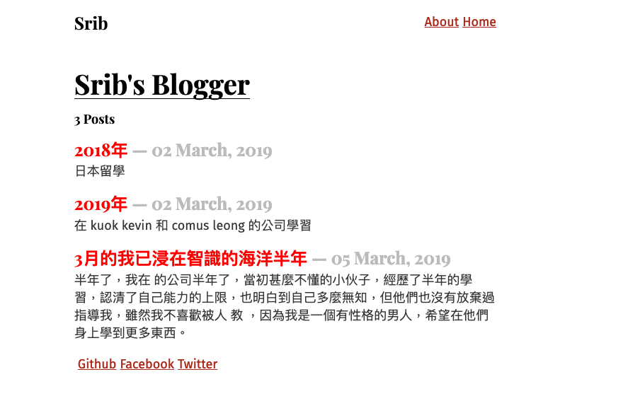

我們的公司是澳門的 **地域有限公司**，而 **WithCloud** 是我們 Github 放 Projects 的地方，也將會是建立各種雲端應用的平台。

公司成立已經有半年了，我們有很多方向性的 Projects。包括有學校和學生的系統、線上夾公仔機、室內定位的應用、電子墨水的應用，等等。 各個 Project 的開始是為了解決澳門客戶的問題，我們的目標很簡單，優化和解決客戶的問題，利用科技使客戶的生活變得更好。因此，想像可以無限大，任何可以使澳門變得更好的 Idea，我們都會不斷 Brain Storm 去令它變成一個公司可持續發展的項目。

### Why Me?

現在 **Why Me** 是一個我們公司集合了有關開發文章的 Blog。或者你會問為什麼不把有關的資訊放到 Trello 或者 Dropbox Paper，這是因為太長的文章不適合放到 Trello Card，而 Dropbox Paper 雖然可以在裡面好好地寫文章，但我想要的功能需要包括能夠每日將文章 email 給各個公司成員。所以最後暫時這裡就以 Blog 的網站形式展示各個開發相關的文章。**最重要是我想先有個平台去 Share 大家的開發工具和知識**。

---

**關於 Blog 的名稱為什麼叫 `Why Me`? (為什麼是我?)**

這是有個故事的，因為我們現在是細小的公司，無論公司的大小事或者開發的大小事，人手不足，往往有時會指派一些原本與你無關的事，然後你就會向天大叫一句 「Why Me? 為什麼是我?」。

我希望大家除了 `Why Me` 外，也想一想 `Why Not Me?` (為什麼不是我?)

人手就是得這麼多，功夫不是我做，就是你做，或者他做。但無論結果如何，事情都需要解決。這就是我為什麼將這個 Blog 改為 Why Me 這個名字。

---

### Dev

三月在科技界較為重大的一件事就是 `.dev` domain 開發給所有人購買。我和周曉峰在幾個月前就已經在等這一天的到來。
到最後我買了三個 domain。第一個就是這個 Blog 用的網址 [whyme.dev](https://whyme.dev)，你二個是我個人的網址 [comus.dev](https://comus.dev)，第三個是周曉峰個人用的網址 [srib.dev](https://srib.dev)，大約 $14 美金一個 `.dev` domain。

我們在個人網頁中利用 [GatsbyJS](https://www.gatsbyjs.org/) 做了最簡單的頁面。Why Me 的 Github source code 可以到 [這裡](https://github.com/withcloud/whyme.dev) 查看

[comus.dev](https://comus.dev), Github: [source code](https://github.com/comus/comus.dev)

[srib.dev](https://srib.dev), Github: [source code](https://github.com/srib1997/sribblogger.github.io)

**在接下來的半年，希望大家繼續努力！三月是我們的新開始！**
